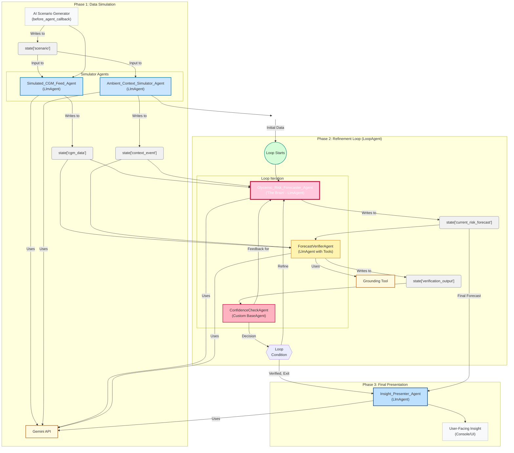

# Glycemic Sentinel

A prototype T1D glycemic insight application built with Google ADK, Gemini, FastAPI, and Angular.

[](https://www.python.org/downloads/)
[](https://fastapi.tiangolo.com)
[](https://cloud.google.com/agent-development-kit)

## Overview

Glycemic Sentinel runs a multi-agent workflow to generate short-form glycemic risk insights from simulated Type 1 Diabetes scenarios. It is intended for experimentation with agent orchestration patterns, refinement loops, and real-time progress tracking.

## Status

- **Project maturity**: Experimental prototype
- **Data source**: Simulated CGM and context events generated by agents
- **Clinical scope**: Not validated for diagnosis or treatment decisions

## Medical Disclaimer

This repository is for research and demonstration purposes only. It is not a medical device and must not be used as a substitute for professional medical advice, diagnosis, or treatment.

## Technical Architecture

The architecture is organized into three phases under `T1dInsightOrchestratorAgent`.

### Architecture Diagram



### Agent Roles

| Agent | Type | Role |
|-------|------|------|
| **AI Scenario Generator** | `before_agent_callback` | Generates the scenario prompt used to seed simulation |
| **T1dInsightOrchestratorAgent** | `SequentialAgent` | Coordinates the end-to-end three-phase workflow |
| **SimulatedCGMFeedAgent** | `LlmAgent` | Produces mock CGM data from the scenario |
| **AmbientContextSimulatorAgent** | `LlmAgent` | Produces mock contextual events from the scenario |
| **LoopRefinementAgent** | `LoopAgent` | Runs iterative forecast/verification refinement |
| **GlycemicRiskForecasterAgent** | `LlmAgent` | Produces initial and revised risk forecasts |
| **ForecastVerifierAgent** | `LlmAgent with Tools` | Evaluates forecast quality against input and grounded references |
| **ConfidenceCheckAgent** | `Custom BaseAgent` | Parses verifier output and controls loop continuation/exit |
| **InsightPresenterAgent** | `LlmAgent` | Formats the final forecast into user-facing text |

## Tech Stack

- **Backend**: Python 3.12+, FastAPI, Uvicorn
- **Agent Runtime**: Google ADK
- **Model Layer**: Gemini models via Vertex AI
- **Frontend**: Angular
- **Streaming**: Server-Sent Events (SSE)

## Setup

### Prerequisites

- Python 3.12+
- Conda or `venv`
- Node.js + npm (for frontend)
- Google Cloud project with Vertex AI enabled
- `gcloud` CLI authenticated

### Clone

```bash
git clone https://github.com/maverickkamal/Glycemic-Sentinel.git
cd Glycemic-Sentinel
```

### Backend Environment

Use either Conda (from repo root) or a virtual environment (inside `backend/`).

**Option A: Conda**
```bash
conda env update -f environment.yml
conda activate t1d-swarm
```

**Option B: venv**
```bash
cd backend
python -m venv .venv
source .venv/bin/activate  # Windows: .venv\Scripts\activate
pip install -r requirements.txt
```

### Google Cloud Authentication

```bash
gcloud auth application-default login
gcloud config set project YOUR_PROJECT_ID
```

## Run

### 1) Start backend API

From `backend/`:

```bash
python main.py
# or
uvicorn main:app --reload --host 0.0.0.0 --port 8080
```

Backend default: `http://localhost:8080`

### 2) Start frontend

From `frontend/`:

```bash
npm install
npm run serve -- --backend=http://localhost:8080
```

Frontend default: `http://localhost:4200`

## API Usage

### Core endpoints

- `GET /docs` - Swagger UI
- `GET /scenarios` - List available scenarios
- `POST /get-scenario/` - Set scenario for session
- `GET /progress/{session_id}` - SSE progress stream
- `GET /current-session/` - Current session/scenario debug info

### Example

```bash
curl -X POST http://localhost:8080/get-scenario/ \
  -H "Content-Type: application/json" \
  -d '{
    "scenario_id": "post_meal_spike",
    "session_id": "test-session",
    "custom_text": ""
  }'
```

## Configuration

Create a `.env` file at the repository root:

```bash
GOOGLE_GENAI_USE_VERTEXAI=true
GOOGLE_CLOUD_PROJECT=your-project-id
GOOGLE_CLOUD_LOCATION=us-central1
GENERATE_SCENARIO_MODEL=gemini-2.0-flash
AMBIENT_CONTEXT_MODEL=gemini-2.0-flash
SIMULATED_CGM_MODEL=gemini-2.0-flash
GLYCEMIC_FORECAST_MODEL=gemini-2.5-pro
FORECAST_VERIFIER_MODEL=gemini-2.5-flash
INSIGHT_PRESENTER_MODEL=gemini-2.5-flash
PORT=8080
```

## Testing

No comprehensive automated test suite is currently documented for the full workflow. Basic endpoint checks can be run with curl after starting the backend.

## Limitations

- Uses simulated data only; no direct integration with live CGM platforms
- Not clinically validated
- Global session state is designed for prototype usage, not production-scale multi-user deployment
- Output quality depends on model behavior and prompt design

## License

This project is licensed under the MIT License.
